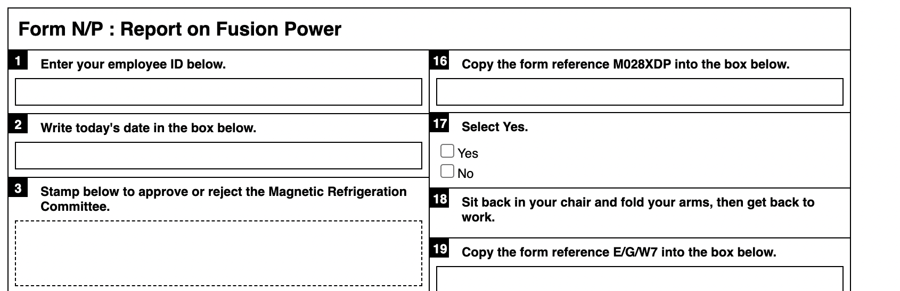

# *It is as if you were doing paperwork?*

# [Click here for paperwork generator and instructions](https://www.pippinbarr.com/it-is-as-if-you-were-doing-paperwork)

## Description
*Nothing feels quite as good as filling out forms! Am I right?! Choose any pen you want and get to it! Check boxes! Sign your name! Calculate numbers! Sigh loudly and scratch your neck! It's all the action of the non-digital office environment in the discomfort of your own home!*

*It is as if you were doing paperwork* is a game of doing paperwork. At its heart it is a paperwork generator that creates forms that contain precise instructions for filling them out. You can't go wrong. It's an analog spiritual successor to my game [*It is as if you were doing work*](https://www.pippinbarr.com/itisasifyouweredoingwork/info) and was developed for the ["What Are the Rules?"](https://v-a-c.org/en/ges2/festival-of-play-and-games-what-are-the-rules) festival at the [VAC](https://v-a-c.org/) in Moscow.

The paper generator was written in JavaScript using jQuery.

## Press
There is no press kit. Should there be? If you want one, I guess I'll make one.

## Process
* Take a look at the [process documentation](../process) for a very incomplete picture of development
* Go through the [code repository](https://www.github.com/pippinbarr/it-is-as-if-you-were-doing-paperwork) if you want the source code

## License
*It is as if you were doing paperwork* is an open source "game" licensed under a [Creative Commons Attribution-NonCommercial 3.0 Unported License](http://creativecommons.org/licenses/by-nc/3.0/). You can obtain the source code from its [code repository](https://github.com/pippinbarr/chesses) on GitHub.
